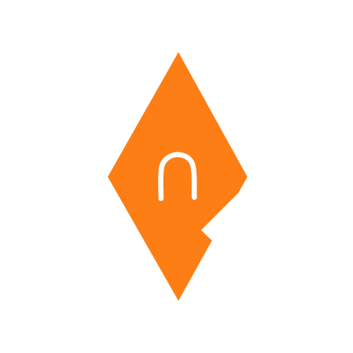

<p align="center">
  <picture>
    <source media="(prefers-color-scheme: dark)" srcset="assets/branding/nueon-logo-bright.png">
    
  </picture>
</p>

# nueon

A conlang editor and creation app for Linux: a Markdown notebook, a
dictionary and word-table editor, an etymology graph, and a translation
builder, backed by a UI-agnostic Rust core and optional git history.

Repository: <https://github.com/y-jar/nueon>

## Project status

nueon is mostly a one-person project with a few testers. Much of the code was
written with AI help. It ships as is, with no warranty, so back up your
workspace before you trust it with anything important.

nueon is MIT licensed. See `LICENSE`, and `NOTICE` for bundled third-party
components.

## Features

- **Workspaces** - a plain folder holding notes, dictionary tables, assets and
  config. Create, open, switch, rename or remove them.
- **Markdown notes** - a CodeMirror 6 editor with live preview, KaTeX, tables,
  task lists and a formatting toolbar. Notes autosave and detect disk
  conflicts.
- **Dictionary grid** - one table per bin of words, custom per-table tags,
  sorting, search, and column resize, reorder and hide.
- **Inspector and etymology** - edit a word's fields and manage multi-parent
  derivation links (a cycle-safe DAG).
- **Translation and morphology** - assemble a clause on a slot canvas,
  inflect words from feature values, and compose new forms from a morpheme
  inventory.
- **Import and export** - import CSV/TSV with a read-only preview; export a
  table to CSV/TSV/JSON or Anki, and notes to PDF or ODT.
- **Assets** - drop an image or text file into the editor or explorer.
- **Version control** - opt-in git with idle auto check-in, status, diff and
  log.
- **Tabs, splits and windows** - tab groups, drag-to-split, persisted layout,
  and torn-off secondary windows.

See [`docs/ARCHITECTURE.md`](docs/ARCHITECTURE.md) for the three-tier design.

## Keyboard shortcuts

In a Markdown note (`Mod` is `Ctrl` on Linux; these bindings live only in the
editor, so they never fire in the dictionary grid, inputs or the inspector):

- `Mod+B` / `Mod+I` / `Mod+U` - bold / italic / underline
- `Mod+K` - link
- `Mod+Shift+7` / `Mod+Shift+8` / `Mod+Shift+9` - numbered / bullet / quote
- `Mod+Shift+C` - code block; `Mod+Shift+X` - strikethrough
- `Mod+1` to `Mod+6` - heading level (the same level again removes it);
  `Mod+0` - normal text
- `Tab` / `Shift+Tab` - next / previous table cell; `Enter` - new table row
- `(` `[` `{` - auto-close the bracket (`'` and `"` are left alone)
- `Mod+Z` / `Mod+Y` - undo / redo; `Mod+W` - close tab
- `Ctrl`/`Cmd`+click - add a cursor; `Alt`+drag - rectangular selection

## Installation

### Nix (recommended)

```sh
# Build the app from source (Rust, Svelte and WebKit/GTK, fully pinned):
nix build .#
./result/bin/nueon

# Or run it directly:
nix run .#
```

A precompiled variant (`nueon-bin`) fetches a published release `.deb`, patches
it for Nix, and wraps it with the same Wayland-safe WebKit flags:

```sh
nix build .#nueon-bin
./result/bin/nueon
```

`nueon-bin` has a placeholder hash until a release exists. After publishing,
refresh it with:

```sh
nix-prefetch-url --type sha256 https://github.com/y-jar/nueon/releases/download/v<version>/nueon_<version>_amd64.deb
```

### Linux packages

`.deb`, `.rpm` and `.AppImage` bundles are published on the
[Releases](https://github.com/y-jar/nueon/releases) page for each `v*` tag.
Install the `.deb` or `.rpm` with your package manager, or mark the AppImage
executable and run it.

### From source

Everything needed (Rust, Node 22, Tauri's WebKit/GTK libraries) is provided by
the Nix dev shell:

```sh
nix-shell
npm install
npm run tauri dev      # hot-reloading dev app
npm run tauri build    # bundles under src-tauri/target/release/bundle
```

## Verification

See [`docs/PROBING.md`](docs/PROBING.md) for the full testing and probing
methodology (unit tests, the WebDriver probe harness, and the traps to avoid).

Run the full gate suite from the Nix shell (`gates` runs exactly these; CI
mirrors them after `npm ci`):

```sh
npm run build
cargo fmt --all --check
cargo clippy --workspace --all-targets -- -D warnings
cargo test --workspace
npm run check          # svelte-check
npm run test           # node:test unit tests
sh scripts/check-icons.sh
sh scripts/test-version.sh
sh scripts/check-version.sh
```

After packaging changes, also verify the app bundles with `nix build .#` (CI
and `gates` do not run it).

## Development

The dev shell provides short aliases and matching `loom-*` commands (`deps dev
run app pkg fmt fmtcheck clippy ctest testall fecheck febuild icons iconcheck
bump versioncheck clean gates`). Run `aliases` in the shell to list them. `run`
builds the Nix package and launches it; `dev` starts the hot-reload server.

## Versioning

Versions are date-based: `YY.M.D` with no zero padding, for example `26.10.6`.
The version is the release date and it always increases. Cargo, npm and Tauri
require three numeric parts, so a major update name like `26.8` is written
`26.8.0` wherever a tool needs three parts; the major label is only a name in
the release notes, never a different version.

Release flow:

```sh
scripts/bump-version.sh     # today's date; or pass YY.M.D explicitly
gates                       # all checks, including scripts/check-version.sh
git commit -am "RELEASE: 26.10.6"
git tag v26.10.6
# publishing (git push, pushing the tag) is a manual, explicit step
```

`scripts/bump-version.sh` writes one version to `Cargo.toml`
(`[workspace.package]`), `Cargo.lock`, `package.json`, `package-lock.json`,
`src-tauri/tauri.conf.json` and every `version = "..."` in `flake.nix`.
`scripts/check-version.sh` fails on any mismatch, a zero-padded or malformed
date, a tag that is not `v` plus the version, or a version that goes backwards
(compared numerically per part, so `26.10.6 > 26.8.19`). It runs in CI and in
`gates` (no tag), and in `release.yml` with the pushed tag.

Until the first release the version is the `0.1.0` placeholder. It is accepted
only when no tag argument is given and no `v*` tag exists yet, and it must
still be identical in every file above; cutting the first date release retires
it (a later `v*` tag also makes `0.1.0` invalid).

**File and workspace formats are versioned separately from the app version.**
The date version tracks the application; the on-disk layout of notes, tables,
assets and the workspace config is not tied to it and changes only when a
migration says so (see `docs/ARCHITECTURE.md` and `deferred.md`).
